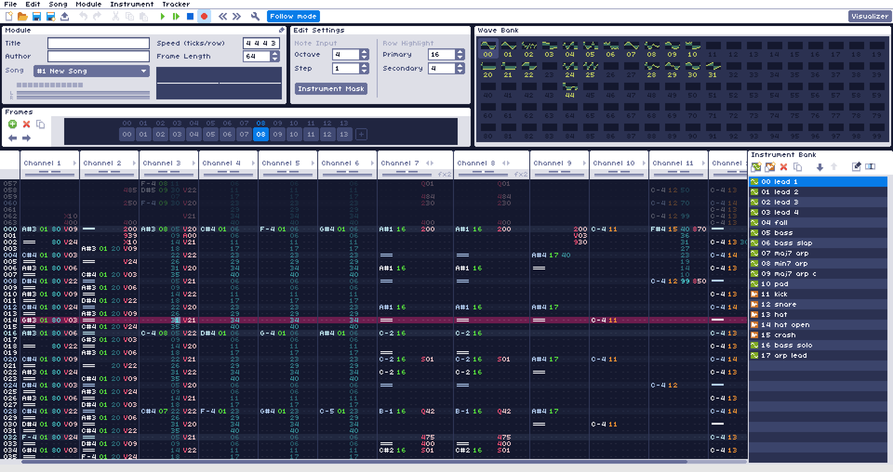

# WaveTracker

  

\
[WaveTracker](https://www.wavetracker.org) is a free and open source chiptune music-making software for Windows. It uses wavetable synthesis and sampling to generate sounds, with endless combinations of effects to warp, modify or distort waves and sounds.

**If you are looking to download WaveTracker, visit the [itch.io](https://squiggygames.itch.io/wavetracker) page.**

### Features

- Realtime playback and editing
- Draw and edit up to 100 waveforms
- Up to 100 instrument macros to control various aspects of the sound
- Sample importing and editing
- MIDI input
- Export to .wav
- Built in oscilloscope and piano roll visualizer

For an in depth explanation of how to use WaveTracker, visit the [official documentation](https://www.wavetracker.org/documentation)

WaveTracker and its source code are licensed under the MIT license.

### Links

- [wavetracker.org](https://www.wavetracker.org)
- [itch.io page](https://squiggygames.itch.io/wavetracker)
- Visit my website: [eliasananiadis.com](https://eliasananiadis.com)

## Contributing

First, thank you so much for wanting to contribute to WaveTracker! If you would like to contribute I suggest opening a feature request or getting in contact with me first to discuss and come up with a roadmap, this way we avoid wasting both our time.

## Contact

If you would like to report a bug or suggest a feature please open an issue here or contact me:
- Twitter: [@squiggythings](https://twitter.com/squiggythings)
- YouTube: [@squiggythings](https://www.youtube.com/channel/UCrNoYf6XA4IHLf-1ZeqN81g?view_as=subscriber)
- Itch.io: [squiggy](https://squiggygames.itch.io/wavetracker)
- E-mail: squiggymakesmusic@gmail.com
